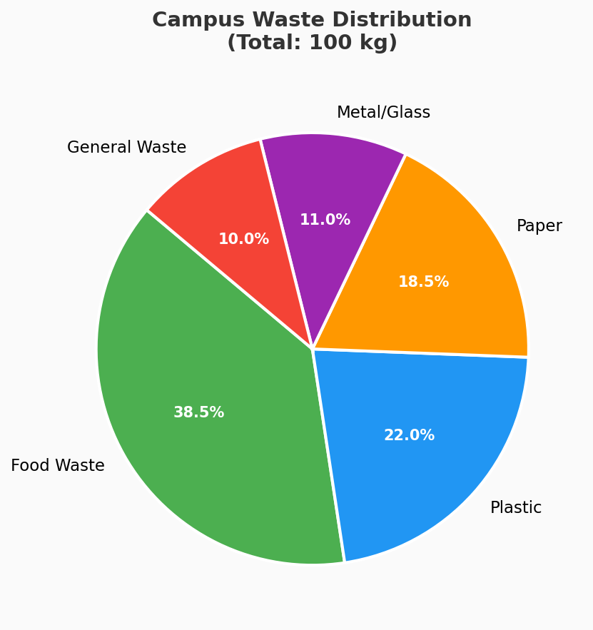
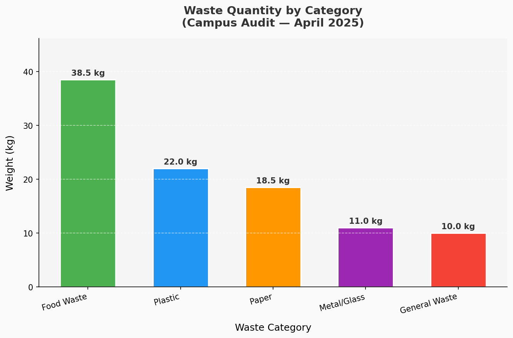

# 🌿 Campus / Community Waste Audit Tool

> A beginner-friendly Python desktop app that reads waste data from an Excel file,
> calculates category totals, and automatically generates a **pie chart** and **bar graph**.

---

## 📌 Project Overview

This tool was built as part of a university sustainability project to help students
and communities track, categorize, and visualize their solid waste generation.

By simply clicking one button, the app:
- Reads the provided Excel spreadsheet (`Waste_Audit_Tool.xlsx`)
- Calculates the total weight and percentage for each waste category
- Saves a **pie chart** and a **bar graph** as `.png` images
- Displays a clean summary popup with key statistics

---

## ✨ Features

| Feature | Details |
|---|---|
| 🖥️ Simple GUI | Built with Python's built-in `tkinter` — no web server needed |
| 📊 Auto Charts | Generates a pie chart + bar graph with one click |
| 📁 Excel Integration | Reads directly from `.xlsx` using `openpyxl` |
| 💾 Image Export | Saves `pie_chart.png` and `bar_graph.png` automatically |
| 🔍 Summary Popup | Shows total waste, top category, and chart file locations |

---

## 📂 File Structure

```
Waste-Audit-Tool/
│
├── waste_audit_app.py        ← Main Python application (GUI + logic)
├── Waste_Audit_Tool.xlsx     ← Sample waste dataset (editable)
├── pie_chart.png             ← Auto-generated pie chart (output)
├── bar_graph.png             ← Auto-generated bar graph (output)
└── README.md                 ← This file
```

---

## 📊 Sample Dataset

| Waste Category | Description | Weight (kg) | % of Total | Disposal Method |
|---|---|---|---|---|
| Food Waste | Cafeteria & kitchen scraps | 38.5 | 38.5% | Composting |
| Plastic | Bottles, bags, packaging | 22.0 | 22.0% | Recycling |
| Paper | Notebooks, printouts, flyers | 18.5 | 18.5% | Recycling |
| Metal / Glass | Cans, bottles, containers | 11.0 | 11.0% | Recycling |
| General Waste | Non-recyclable mixed waste | 10.0 | 10.0% | Landfill |
| **TOTAL** | | **100.0** | **100%** | |

> 📝 You can edit the Excel file with your own campus data — the app will automatically pick up the changes.

---

## 🖼️ Sample Output

### Pie Chart
Displays the **percentage share** of each waste category in a colour-coded pie.
### Pie Chart



### Bar Graph
Shows the **weight (in kg)** for each category with labelled bars for easy comparison.

Both images are saved in the same folder as the script when the audit is run.
### Bar Graph



---

## ▶️ How to Run

### Prerequisites

Make sure Python 3 is installed, then install the two required libraries:

```bash
pip install openpyxl matplotlib
```

### Running the App

```bash
python waste_audit_app.py
```

1. The green GUI window opens.
2. Click **"▶ Run Waste Audit"**.
3. The app reads `Waste_Audit_Tool.xlsx`, generates both charts, and shows a summary popup.
4. Charts are saved as `pie_chart.png` and `bar_graph.png` in the same folder.

---

## 🛠️ Technologies Used

| Tool | Purpose |
|---|---|
| Python 3 | Core programming language |
| tkinter | GUI window and buttons (built into Python) |
| openpyxl | Reading `.xlsx` Excel files |
| matplotlib | Generating pie chart and bar graph |

---

## 🎓 Academic Note

This project demonstrates:
- Reading structured data from Excel files
- Visualizing data with Python charts
- Building a simple desktop GUI application
- Applying software tools to a real-world sustainability problem

---
## 🔍 Key Insight

- Food Waste is the highest contributor (~38.5%)
- Plastic is the second major waste (~22%)
- Recommendation: Focus on composting and plastic reduction

## 📃 License

This project is submitted for academic purposes.
Free to use and modify for educational use.

---

*Made with 🌱 for a greener campus.*


